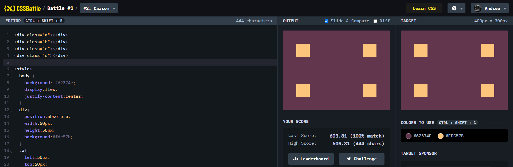

# Battle #1 - Pilot Battle

## #2 - Carrom

[Link to the problem](https://cssbattle.dev/play/2)



```html
<div id="a"></div>
<div id="b"></div>
<div id="c"></div>
<div id="d"></div>

<style>
  body {
    margin: 0;
    background: #62374e;
  }
  div {
    width: 50px;
    height: 50px;
    background: #fdc57b;
    display: inline-block;
  }
  #a {
    margin-top: 50px;
    margin-left: 50px;
  }
  #b {
    margin-top: 50px;
    margin-left: 200px;
  }
  #c {
    margin-top: 100px;
    margin-left: 50px;
  }
  #d {
    margin-top: 100px;
    margin-left: 200px;
  }
</style>
```
