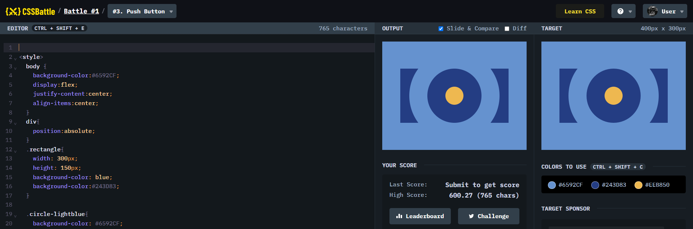

# Battle #1 - Pilot Battle

## #3 - Push Button

[Link to the problem](https://cssbattle.dev/play/3)



```html
<div class = "rectangle"></div>
<div class = "circle-lightblue"></div>
<div class = "circle-blue"></div>
<div class = "circle-yellow"></div>
<style>
  body {
    background-color:#6592CF;
    display:flex;
    justify-content:center;
    align-items:center;
  }
  div{
    position:absolute;
  }
  .rectangle{
    width: 300px;
    height: 150px;
    background-color: blue;
    background-color:#243D83;
  }
  
  .circle-lightblue{
    background-color: #6592CF;
    width: 250px;
    height: 250px;
    border-radius: 100%
  }
  .circle-blue{
    background-color: #243D83;
    width: 150px;
    height: 150px;
    border-radius: 100%
  }
  .circle-yellow{
    background-color: #EEB850;
    width: 50px;
    height: 50px;
    border-radius: 100%
  }
  
</style>

```
