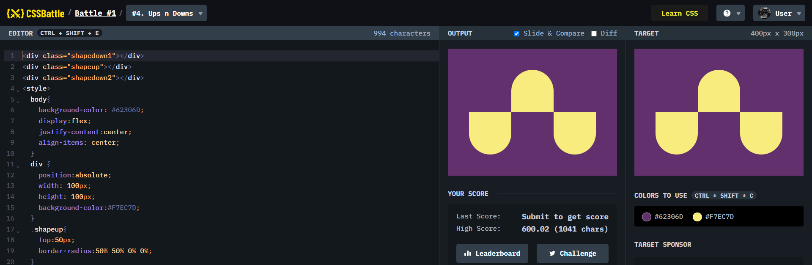

# Battle #1 - Pilot Battle

## #4 - Ups n Downs

[Link to the problem](https://cssbattle.dev/play/4)



```html
<div class="wrapper">
  <div class="inner hide"></div>
  <div class="inner show up"></div>
  <div class="inner hide"></div>
  <div class="inner show down"></div>
  <div class="inner hide"></div>
  <div class="inner show down"></div>
</div>
<style>
<div class="shapedown1"></div>
<div class="shapeup"></div>
<div class="shapedown2"></div>
<style>
  body{
    background-color: #62306D;
    display:flex;
    justify-content:center;
    align-items: center;
  }
  div {
    position:absolute;
    width: 100px;
    height: 100px;
    background-color:#F7EC7D;
  }
  .shapeup{
    top:50px;
    border-radius:50% 50% 0% 0%;
  }

  .shapedown1{
    bottom:50px;
    left:50px;
    border-radius:0% 0% 50% 50%;
  }

  .shapedown2{
    bottom:50px;
    right:50px;
    border-radius:0% 0% 50% 50%;
  }
</style>

```
