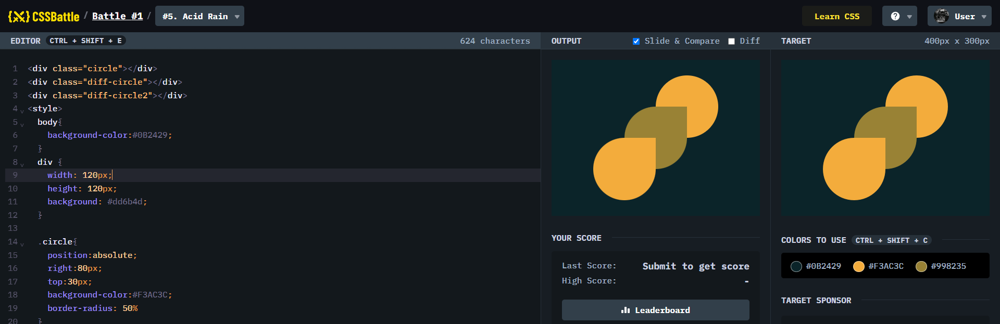

# Battle #1 - Pilot Battle

## #5 - Acid Rain

[Link to the problem](https://cssbattle.dev/play/5)



```html
<div class="circle"></div>
<div class="diff-circle"></div>
<div class="diff-circle2"></div>
<style>
  body{
    background-color:#0B2429;
  }
  div {
    width: 120px;
    height: 120px;
    background: #dd6b4d;
  }

  .circle{
    position:absolute;
    right:80px;
    top:30px;
    background-color:#F3AC3C;
    border-radius: 50%
  }
  .diff-circle{
    position:absolute;
    right:140px;
    top:90px;
    background-color:#998235;
    border-radius: 50% 0 50% 50%
  }
    .diff-circle2{
    position:absolute;
    right:200px;
    top:150px;
    background-color:#F3AC3C;
    border-radius: 50% 0 50% 50%
  }
</style>
```
