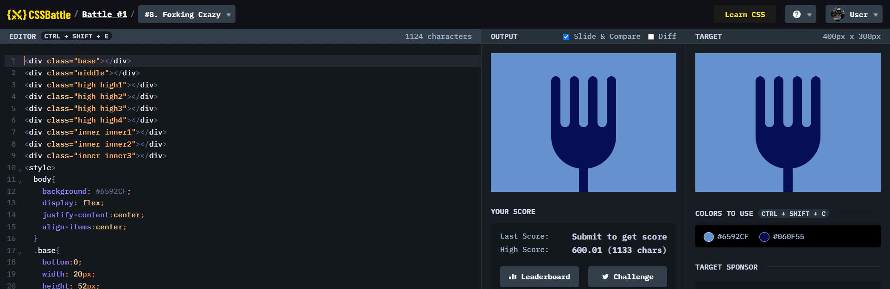

# Battle #1 - Pilot Battle

## #8 - Forking Crazy

[Link to the problem](https://cssbattle.dev/play/8)



```html
<div class="base"></div>
<div class="middle"></div>
<div class="high high1"></div>
<div class="high high2"></div>
<div class="high high3"></div>
<div class="high high4"></div>
<div class="inner inner1"></div>
<div class="inner inner2"></div>
<div class="inner inner3"></div>
<style>
  body{
    background: #6592CF;
    display: flex;
    justify-content:center;
    align-items:center;
  }
  .base{
    bottom:0;
    width: 20px;
    height: 52px;
  }
  .middle{
    bottom: 50px;
    width: 140px;
    height: 100px;
    border-radius:0 0 70px 70px;
  }
  .high{
    width: 20px;
    height: 130px;
    border-radius:70px 70px;
  }
  .high1{
    left:130px;
    top: 50px;
  }
  .high2{
    left:170px;
    top: 50px;
  }
  .high3{
    left:210px;
    top: 50px;
  }
  .high4{
    left:250px;
    top: 50px;
  }
  .inner{
    width: 20px;
    height: 110px;
    border-radius:70px 70px;
    background: #6592CF;
  }
  .inner1{
    left:150px;
    top: 50px;
  }
  .inner2{
    left:190px;
    top: 50px;
  }
  .inner3{
    left:230px;
    top: 50px;
  }
  div {
    position:absolute;
    background: #060F55;
  }
</style>
```
