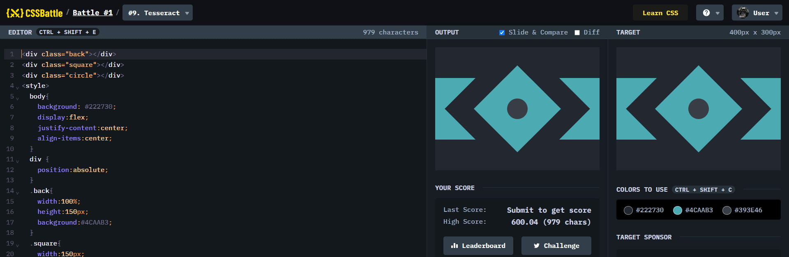

# Battle #1 - Pilot Battle

## #9 - Tesseract

[Link to the problem](https://cssbattle.dev/play/9)



```html
<div class="back"></div>
<div class="square"></div>
<div class="circle"></div>
<style>
  body{
    background: #222730;
    display:flex;
    justify-content:center;
    align-items:center;
  }
  div {
    position:absolute;
  }
  .back{
    width:100%;
    height:150px;
    background:#4CAAB3;
  }
  .square{
    width:150px;
    height:150px;
    background:#4CAAB3;
    transform: rotate(45deg);
    outline: 50px solid #222730;
  }
  .circle{
    width:50px;
    height: 50px;
    background:#393E46;
    border-radius:50%;
  }
</style>
```
