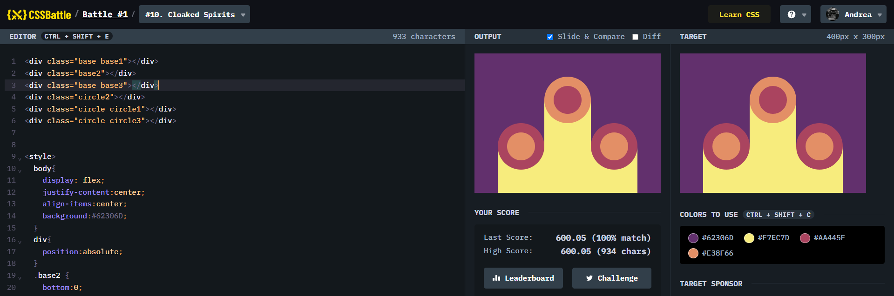

# Battle #1 - Pilot Battle

## #10 - Cloaked Spirits

[Link to the problem](https://cssbattle.dev/play/10)



```html
<div class="base base1"></div>
<div class="base2"></div>
<div class="base base3"></div>
<div class="circle2"></div>
<div class="circle circle1"></div>
<div class="circle circle3"></div>


<style>
  body{
    display: flex;
    justify-content:center;
    align-items:center;
    background:#62306D;
  }
  div{
    position:absolute;
  }
  .base2 {
    bottom:0;
    width: 100px;
    height: 200px;
    background: #F7EC7D;
  }
  .base{
    bottom: 0;
    width:100px;
    height: 100px;
    background:#F7EC7D;
  }
  .base1{
    left: 50px;
  }
  .base3{
    right: 50px;
  }
  .circle2{
    top:70px;
    width:60px;
    height:60px;
    border-radius:50%;
    background:#AA445F;
    outline:20px solid #E38F66;
  }
  .circle{
    width:60px;
    height:60px;
    border-radius:50%;
    background:#E38F66;
    outline:20px solid #AA445F;
    top:170px;
  }
  .circle1{
    left:70px;
  }
  .circle3{
    right:70px;

  }
</style>
```
