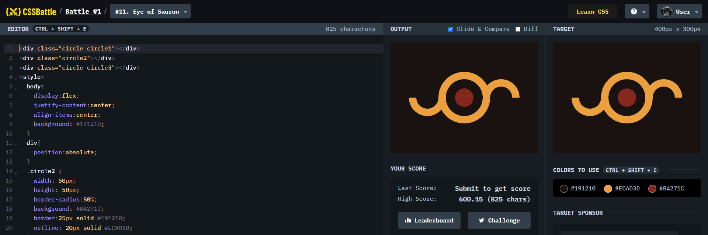

# Battle #1 - Pilot Battle

## #11 - Eye of Sauron

[Link to the problem](https://cssbattle.dev/play/11)



```html
<div class="circle circle1"></div>
<div class="circle2"></div>
<div class="circle circle3"></div>
<style>
  body{
    display:flex;
    justify-content:center;
    align-items:center;
    background: #191210;
  }
  div{
    position:absolute;
  }
  .circle2 {
    width: 50px;
    height: 50px;
    border-radius:50%;
    background: #84271C;
    border:25px solid #191210;
    outline: 20px solid #ECA03D;
  }
  .circle{
    top:100px;
    width: 60px;
    height: 60px;
    border-radius:50%;
    background: transparent;
    border-top: 20px solid transparent;
    border-right: 20px solid transparent;
    border-left: 20px solid #ECA03D;
    border-bottom: 20px solid #ECA03D;
  }
  .circle1{
    left: 50px;
    transform: rotate(-45deg);
  }

  .circle3{
    right: 50px;
    transform: rotate(135deg);
  }
  
</style>
```
