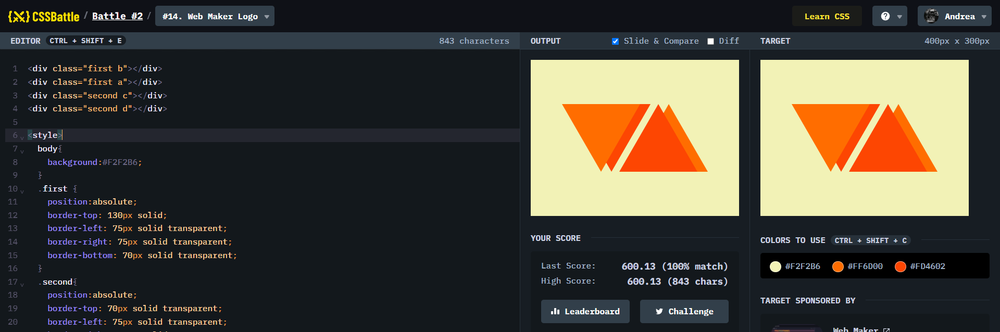

# Battle #2 - Visibility

## #14 - Web Maker Logo

[Link to the problem](https://cssbattle.dev/play/14)



```html
<div class="first b"></div>
<div class="first a"></div>
<div class="second c"></div>
<div class="second d"></div>

<style>
  body{
    background:#F2F2B6;
  }
  .first {
    position:absolute;
    border-top: 130px solid;
    border-left: 75px solid transparent;
    border-right: 75px solid transparent;
    border-bottom: 70px solid transparent;
  }
  .second{
    position:absolute;
    border-top: 70px solid transparent;
    border-left: 75px solid transparent;
    border-right: 75px solid transparent;
    border-bottom: 130px solid;
  }
  .a{
    border-top-color:#FF6D00;
    left:60px;
    top:85px;
  }
  .b{
    border-top-color:#FD4602;
    left:80px;
    top:85px;
  }
  .c{
    border-bottom-color:#FF6D00;
    right:60px;
    bottom:85px;
  }
  .d{
    border-bottom-color:#FD4602;
    right:80px;
    bottom:85px;
  }
</style>
```
