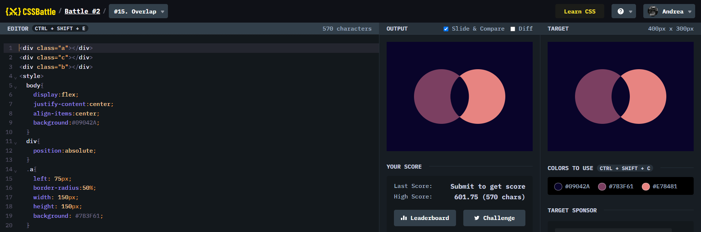

# Battle #2 - Visibility

## #14 - Web Maker Logo

[Link to the problem](https://cssbattle.dev/play/15)



```html
<div class="a"></div>
<div class="c"></div>
<div class="b"></div>
<style>
  body{
    display:flex;
    justify-content:center;
    align-items:center;
    background:#09042A;
  }
  div{
    position:absolute;
  }
  .a{
    left: 75px;
    border-radius:50%;
    width: 150px;
    height: 150px;
    background: #7B3F61;
  }
  .c{
    right: 75px;
    border-radius:50%;
    width: 150px;
    height: 150px;
    background: #E78481;
  }
  .b{
    border-radius:100% 6%;
    transform:rotate(-45deg);
    width: 80px;
    height: 80px;
    background:#09042A
  }
</style>
```
