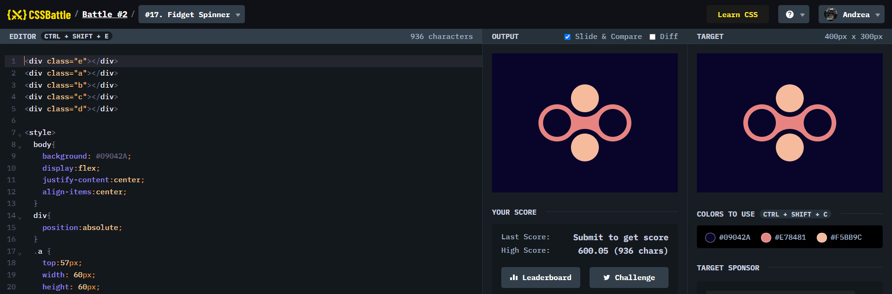

# Battle #2 - Visibility

## #14 - Web Maker Logo

[Link to the problem](https://cssbattle.dev/play/17)



```html
<div class="e"></div>
<div class="a"></div>
<div class="b"></div>
<div class="c"></div>
<div class="d"></div>

<style>
  body{
    background: #09042A;
    display:flex;
    justify-content:center;
    align-items:center;
  }
  div{
    position:absolute;
  }
  .a {
    top:57px;
    width: 60px;
    height: 60px;
    border-radius:50%;
    border:10px solid #09042A;
    background: #F5BB9C;
  }
  .b {
    bottom:57px;
    width: 60px;
    height: 60px;
    border-radius:50%;
    border:10px solid #09042A;
    background: #F5BB9C;
  }
  .c{
    left:100px;
    width: 60px;
    height: 60px;
    border-radius:50%;
    background: transparent;
    border:10px solid #E78481
  }
  .d{
    right:100px;
    width: 60px;
    height: 60px;
    border-radius:50%;
    background: transparent;
    border:10px solid #E78481
  }
  .e{
    width: 60px;
    height: 60px;
    background: #E78481;
    border-radius-top:50%;
  }
  
</style>
```