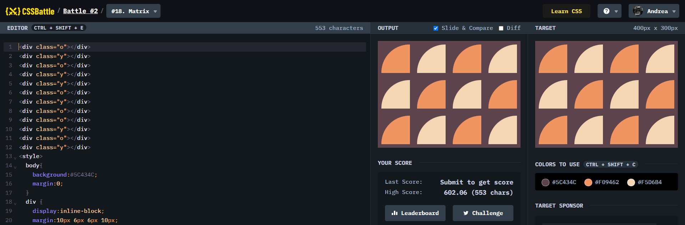

# Battle #2 - Visibility

## #14 - Web Maker Logo

[Link to the problem](https://cssbattle.dev/play/18)



```html
<div class="o"></div>
<div class="y"></div>
<div class="o"></div>
<div class="y"></div>
<div class="y"></div>
<div class="o"></div>
<div class="y"></div>
<div class="o"></div>
<div class="o"></div>
<div class="y"></div>
<div class="o"></div>
<div class="y"></div>
<style>
  body{
    background:#5C434C;
    margin:0;
  }
  div {
    display:inline-block;
    margin:10px 6px 6px 10px;
    border-radius:100% 0 0;
    width: 80px;
    height: 80px;
    background: #dd6b4d;
  }
  .o{
    background:#F09462;
  }
  .y{
    background:#F5D6B4
  }
</style>
```
