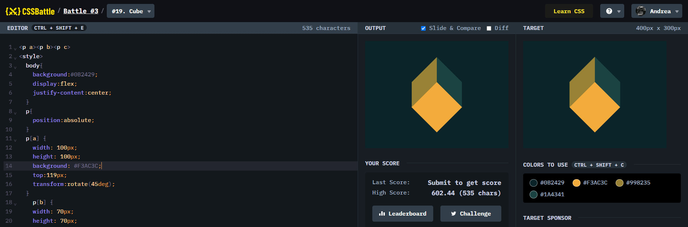

# Battle #3 - Cursor

## #19 - Cube

[Link to the problem](https://cssbattle.dev/play/19)



```html
<p a><p b><p c>
<style>
  body{
    background:#0B2429;
    display:flex;
    justify-content:center;
  }
  p{
    position:absolute;
  }
  p[a] {
    width: 100px;
    height: 100px;
    background: #F3AC3C;
    top:119px;
    transform:rotate(45deg);
  }
    p[b] {
    width: 70px;
    height: 70px;
    background: #998235;
    top:64px;
    left:130px;
    transform:skew(0deg, -45deg)
  }
  p[c]{
    width: 70px;
    height: 70px;
    background: #1A4341;
    top:64px;
    right:130px;
    transform:skew(0, 45deg)
  }
</style>
```
