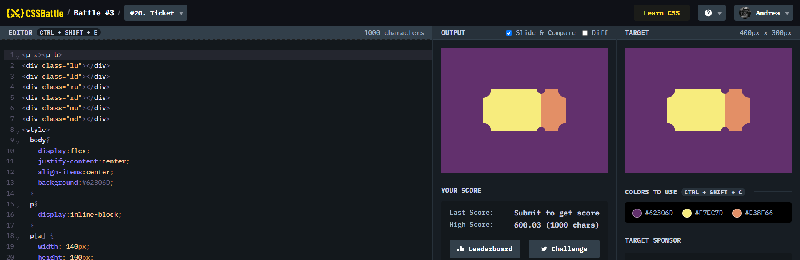

# Battle #3 - Cursor

## #20 - Ticket

[Link to the problem](https://cssbattle.dev/play/20)



```html
<p a><p b>
<div class="lu"></div>
<div class="ld"></div>
<div class="ru"></div>
<div class="rd"></div>
<div class="mu"></div>
<div class="md"></div>
<style>
  body{
    display:flex;
    justify-content:center;
    align-items:center;
    background:#62306D;
  }
  p{
    display:inline-block;
  }
  p[a] {
    width: 140px;
    height: 100px;
    background: #F7EC7D;
  }
  p[b]{
    width: 60px;
    height: 100px;
    background: #E38F66;
  }
  div{
    position:absolute;
    border-radius:50%;
    background:#62306D;
  }
  .lu{
    width: 40px;
    height: 40px;
    top:80px;
    left:80px;
  }
  .ld{
    width: 40px;
    height: 40px;
    bottom:80px;
    left:80px;
  }
  .ru{
    width: 40px;
    height: 40px;
    top:80px;
    right:80px;
  }
  .rd{
    width: 40px;
    height: 40px;
    bottom:80px;
    right:80px;
  }
  .mu{
    width: 20px;
    height: 20px;
    top:90px;
    right:150px;
  }
  .md{
    width: 20px;
    height: 20px;
    bottom:90px;
    right:150px;
  }
</style>
```
